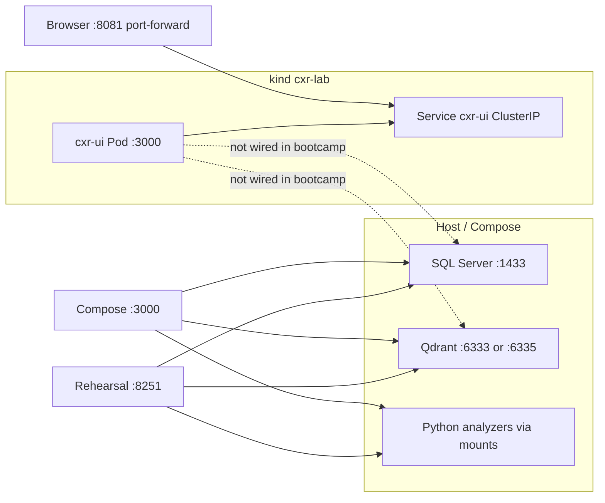

# M4.8 — CXR on Kubernetes: dependency diagram

Bootcamp placement: pod runs **UI shell**; data plane stays on the host or Compose until you add in-cluster services.

**Evidence path:** `helm/cxr-ui/` + `kubectl get all -n cxr-ui` + screenshot of http://localhost:8081.
