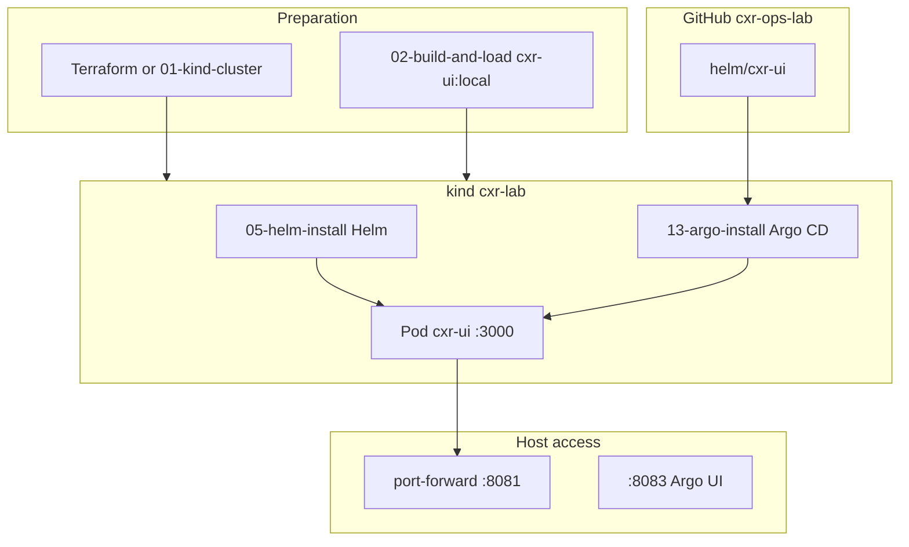
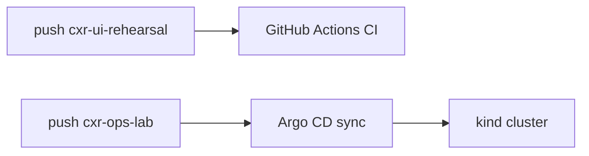

# CXR Kubernetes Deployment Manual (Markdown summary)

**PDF version:** run `./scripts/build-k8-manual-pdf.sh` → `docs/manuals/k8/manual.pdf`  
**GitHub:** https://github.com/UdonsiKalu/cxr-ops-lab  
**Date:** 2026-05-28

---

## Executive summary

| Layer | Tool | Role |
|-------|------|------|
| Cluster | **kind** `cxr-lab` | Local Kubernetes (SW.3) |
| Provision | **Terraform** | Reproducible `kind` create (SW.5) |
| Package | **Helm** `helm/cxr-ui` | Parameterized deploy (SW.4) |
| Deliver | **Argo CD** | GitOps CD from GitHub (SW.8) |
| Image | **Docker** `cxr-ui:local` | Same SW.1 app in cluster |
| CI (separate) | **cxr-ui-rehearsal** | Build/test/Trivy — does not deploy to kind |

**URLs:** :8251 dev · :3000 compose · **:8081** K8 UI · **:8083** Argo

---

## End-to-end flow (diagram)



---

## CI vs CD



- **CI** = quality gate (build, Playwright, Trivy).
- **CD** = Argo keeps cluster = Git (`helm/cxr-ui`).
- **Alternative:** GHA runs `helm upgrade` (push-based CD) — valid, not wired for this local lab.

---

## Folder map (`cxr-ops-lab`)

```
cxr-ops-lab/
├── Dockerfile                 # SW.1 → cxr-ui:local
├── helm/cxr-ui/               # SW.4 + Argo source path
├── k8s/                       # SW.3 raw YAML
│   └── argocd/application-cxr-ui.yaml
├── terraform/                 # SW.5
├── scripts/
│   ├── 00-install-tools.sh
│   ├── 01-kind-cluster.sh
│   ├── 02-build-and-load.sh
│   ├── 03-k8-up.sh
│   ├── 05-helm-install.sh
│   ├── 12-k8-ensure.sh
│   ├── 13-argo-install.sh
│   ├── 14-stack-test.sh
│   └── 15-e2e-deploy.sh
└── evidence/                  # SW.3, SW.4, SW.8 proof
```

**App build context:** `../cxr-ui-prune-rehearsal/cxr-ui` (not inside ops-lab repo).

---

## Commands (quick reference)

```bash
cd /path/to/cxr-ops-lab
export PATH="$PWD/bin:$PATH"
./scripts/00-install-tools.sh

# Full stack
./scripts/15-e2e-deploy.sh

# Or layer by layer
terraform -chdir=terraform apply
./scripts/02-build-and-load.sh
./scripts/05-helm-install.sh
./scripts/13-argo-install.sh

kubectl port-forward -n cxr-ui svc/cxr-ui 8081:3000 --address=127.0.0.1
kubectl port-forward -n argocd svc/argocd-server 8083:443 --address=127.0.0.1
```

---

## Helm + Git day-to-day

1. Edit `helm/cxr-ui/values.yaml`
2. `git push` to `cxr-ops-lab`
3. Argo app `cxr-ui` → Synced / Healthy
4. Browse http://localhost:8081

**Not automatic:** kind running, image loaded, port-forward up.

---

## Dependencies (M4.8)

K8 pod = UI shell. SQL / Qdrant / analyzers = host or Compose (:8251, :3000).

---

## Replicate on another environment

1. Clone `cxr-ops-lab` + set app path (`CXR_UI_SRC`).
2. Use registry + image tag in Helm values (not only `cxr-ui:local`).
3. Point Argo at your Git remote + credentials.
4. Use Ingress/LB instead of port-forward.
5. Optional: cloud cluster instead of kind.

---

## Evidence files

- `evidence/SW3-k8-evidence.md`
- `evidence/SW4-helm-verify-2026-05-28.md`
- `evidence/SW8-e2e-stack-2026-05-28.md`

See **CXR-K8-DEPLOYMENT-MANUAL.pdf** for the full printable report with TikZ diagrams.
