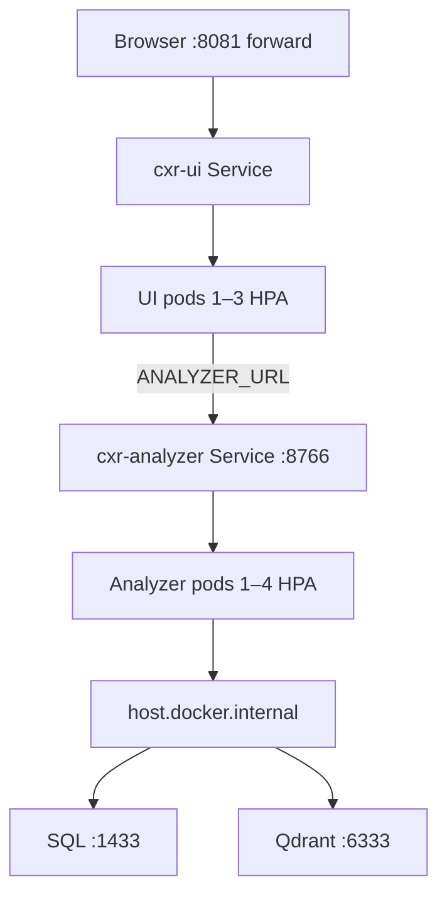

# CXR Kubernetes stack — UI + analyzer + HPA

Full bootcamp deploy: **Next.js UI** and **warm Python analyzer** in **`kind cxr-lab`**, with **HorizontalPodAutoscaler** on both tiers.

## Quick start

**Prerequisites:** Docker Desktop with Kubernetes enabled, host SQL (**:1433**), Qdrant (**:6333**), optional OTel (**:4318**). First analyzer image build is **15–30 min** (CPU torch/faiss).

**Recommended (Docker Desktop K8 — no kind):**

```bash
cd ~/staging/cxr-ops-lab
export PATH="$PWD/bin:$PATH"

# One-shot: enable Desktop K8 + deploy UI + analyzer + HPA
CXR_SKIP_ANALYZER_BUILD=1 ./scripts/03-k8-desktop-stack-up.sh   # if images already built
./scripts/16-k8-stack-verify.sh
```

**Legacy kind path (parked — see `archive/kind/README.md`):**

```bash
./scripts/03-k8-stack-up.sh   # only if you recreate kind cxr-lab
```

**Access UI:**

```bash
# Idempotent — exits 0 if :8081 already forwarded (e.g. cxr-k8-forward.service)
./scripts/k8-ui-forward.sh check
# Or full stack verify (pods + analyzer + UI):
./scripts/16-k8-stack-verify.sh
# http://localhost:8081 — ANALYZER_URL=http://cxr-analyzer:8766 in pod
```

Do **not** run raw `kubectl port-forward … 8081:3000` if **:8081** is already in use — use the scripts above.

**Watch autoscaling:**

```bash
# Snapshot (pods + HPA — no watch flag; kubectl -w allows one resource type only)
./scripts/k8-hpa-status.sh
# or: kubectl get pods,hpa -n cxr-ui

# Live — both pods + HPA (uses watch(1), refreshes every 2s)
./scripts/k8-hpa-watch.sh

# Live — HPA replicas only (native kubectl watch)
kubectl get hpa -n cxr-ui -w
```

## Architecture



## Code map

| Path | Purpose |
|------|---------|
| `helm/cxr-analyzer/` | Analyzer Deployment, Service, **HPA** |
| `helm/cxr-ui/` | UI Deployment, Service, **HPA**, `ANALYZER_URL` |
| `docker/analyzer/Dockerfile` | Analyzer container (CPU torch/faiss/ODBC) |
| `docker/analyzer/requirements.txt` | Pip deps for analyzer image |
| `kind/cxr-lab.yaml` | kind config + **host.docker.internal** |
| `scripts/03-k8-stack-up.sh` | One-shot deploy |
| `scripts/02-build-analyzer-and-load.sh` | Build/load `cxr-analyzer:local` |
| `scripts/06-helm-install-stack.sh` | Helm analyzer + UI + metrics-server |
| `scripts/09-metrics-server-install.sh` | HPA prerequisite |

**Application changes** (for in-cluster + probes):

| Path | Change |
|------|--------|
| `claim_analysis_tools/analyzer_service_app.py` | `GET /health/ready` (503 until warmed) |
| `claim_analysis_tools/archetype_catalog_v3_1_master/cxr_kernel_full_context.py` | `CXR_QDRANT_URL`, `CXR_SQL_SERVER` env |

## HPA defaults

| Workload | min | max | CPU target |
|----------|-----|-----|------------|
| **cxr-analyzer** | 1 | 4 | 70% |
| **cxr-ui** | 1 | 3 | 80% |

Edit `helm/cxr-analyzer/values.yaml` and `helm/cxr-ui/values.yaml` → `autoscaling.*`.

Disable HPA: `autoscaling.enabled: false` and set `replicaCount` manually.

## Host dependencies (kind)

Pods reach host services via **`host.docker.internal`** (kind `extraHosts` in `kind/cxr-lab.yaml`).

If analyzer pods cannot reach SQL/Qdrant on an **existing** cluster:

```bash
kind delete cluster --name cxr-lab
./scripts/03-k8-stack-up.sh
```

Override host IP: `CXR_HOST_IP=172.17.0.1 ./scripts/01-kind-cluster.sh`

## Skip analyzer build (UI-only retest)

```bash
CXR_SKIP_ANALYZER_BUILD=1 ./scripts/03-k8-stack-up.sh
```

## Load-test autoscale

1. Ensure UI **:8081** is up: `./scripts/k8-ui-forward.sh check`
2. Terminal A: `./scripts/k8-hpa-watch.sh` (or `kubectl get hpa -n cxr-ui -w`)
3. Terminal B: Locust against **:8081**:
   ```bash
   CXR_LOAD_URL=http://127.0.0.1:8081 ./scripts/22-load-locust.sh --restart
   # headless (no :8089): ... --headless
   ```
   If **:8089** in use (e.g. old Locust on **:8251**), **`check`** or **`--restart`** — do not start a second Locust on **8089**.
4. Snapshot anytime: `./scripts/k8-hpa-status.sh`

**SRE time-series (CSV + charts):** see **`cxr-portfolio/investigations/kubernetes-analyzer-saturation/`** — `./run-k8-load-with-metrics.sh` + `plot_load_test.py`.

Do **not** use `kubectl get hpa,pods -n cxr-ui -w` — kubectl rejects multiple types with `--watch`.

Tune `maxReplicas` using [LOAD-002](https://github.com/UdonsiKalu/cxr-portfolio) knee (~15 RPS per analyzer).

**LOAD-003** (single-node, analyzer max **4**, UI max **3**): [kubernetes-analyzer-saturation](https://github.com/UdonsiKalu/cxr-portfolio/tree/master/investigations/kubernetes-analyzer-saturation).

**LOAD-004** (expanded cluster + higher HPA caps — analyzer max **8**, UI max **5**):

```bash
./scripts/01-kind-recreate-expanded.sh          # 1 CP + 2 workers
CXR_SKIP_ANALYZER_BUILD=1 ./scripts/04-kind-load-images-only.sh
./scripts/06-helm-install-stack.sh
./scripts/16-k8-stack-verify.sh
kubectl get hpa -n cxr-ui   # MAXPODS 8 / 5
```

Runbook: **`cxr-portfolio/investigations/kubernetes-analyzer-saturation/LOAD-004-capacity-expanded.md`**.

## Legacy UI-only path

`./scripts/03-k8-up.sh` still deploys **UI shell only** (no analyzer, no HPA). Use **`03-k8-stack-up.sh`** for the full stack.
